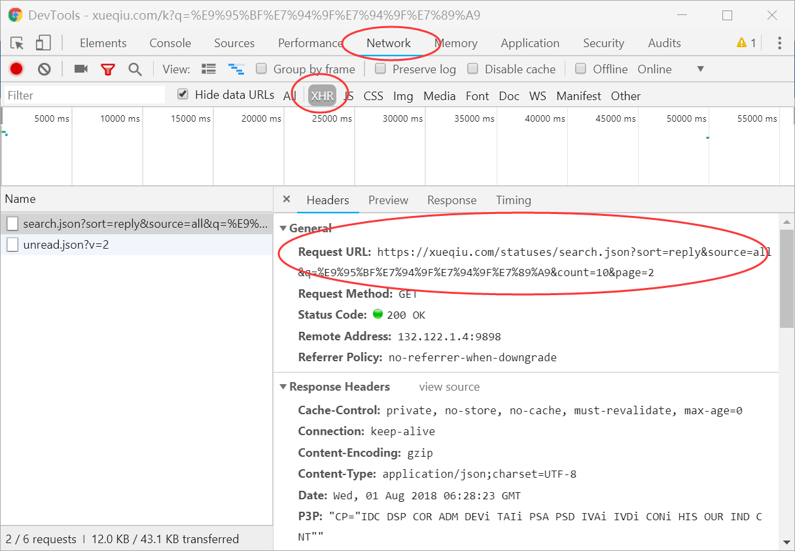
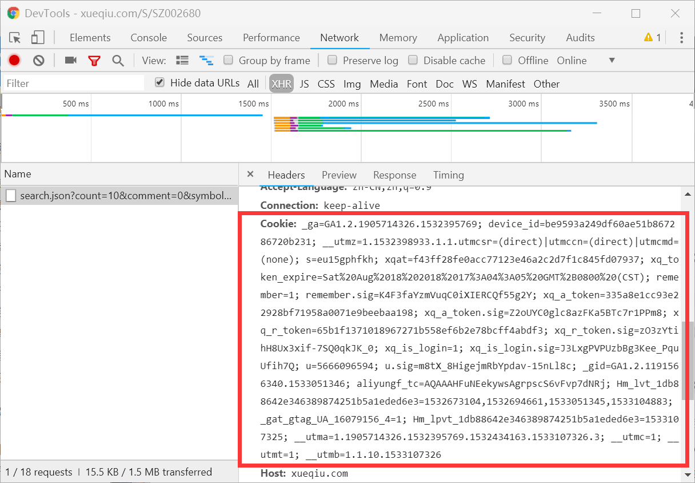

# 雪球爬虫


​    长生生物问题疫苗事件严重且恶劣，长生生物作为上市公司，影响着千千万万个股民，为了一探股民们在事件爆发后的看法，我爬取了10000条雪球评价进行分析。

​    本爬虫采取的是requests+bs4的路线，为了对抗反爬，使用了修改请求头、伪装cookies、降低爬取频率等策略，并将爬取到的数据存储在mysql数据库中，最后通过jupyter notebook进行数据分析。

- 主程序是"spider/xueqiu_spider.py"

- 数据分析程序是"analyse/cssw_analyse.ipynb"。

- 数据分析的结果在analyse文件夹的readme。

- 数据库操作的相关程序在"spider/mysqls.py"

  下面是部分关键代码介绍：

### 异步数据爬取

我们发现雪球网跟新浪等网站一样，需要进行异步爬虫，使用Chrome浏览器的开发者工具，可以非常简单的获取到数据的接口为：https://xueqiu.com/statuses/search.json?sort=reply&source=all&q=长生生物&count=10&page=2，其中page=2是页码，不断更换页码即可获得相对应的数据，经过检测，雪球网只能提供100页的数据，再往后的数据就获取不到了，这时候我们可以更改排序规则sort=reply，按照不同的规则提取前100页数据，得到的结果去重，就能过获得尽量多的数据了。



### 反爬虫对抗

#### 1.修改请求头

我们使用一个非常方便的库——fake_useragent，可以得到随机的浏览器请求头，用法如下

```python
from fake_useragent import UserAgent
ua = UserAgent()
headers = {'User-Agent':ua.random}
```

#### 2.修改cookies

雪球的评论数据需要登录后才能获取，下面介绍一种非常简单方便的绕过登录的方法。

1. 在网页上进行登录
2. 使用Chrome浏览器的开发者工具，查询当前请求的cookie
3. 复制浏览器中的cookie，使用此cookie对我们的请求进行伪装



```python
cookie= "_ga=GA1.2.1905714326.1532395769; device_id=be9593a249df60ae51b867286720b231; __utmz=1.1532398933.1.1.utmcsr=(direct)|utmccn=(direct)|utmcmd=(none); s=eu15gphfkh; xqat=f43ff28fe0acc77123e46a2c2d7f1c845fd07937; xq_token_expire=Sat%20Aug%2018%202018%2017%3A04%3A05%20GMT%2B0800%20(CST); remember=1; remember.sig=K4F3faYzmVuqC0iXIERCQf55g2Y; xq_a_token=335a8e1cc93e22928bf71958a0071e9beebaa198; xq_a_token.sig=Z2oUYC0glc8azFKa5BTc7r1PPm8; xq_r_token=65b1f1371018967271b558ef6b2e78bcff4abdf3; xq_r_token.sig=zO3zYtihH8Ux3xif-7SQ0qkJK_0; xq_is_login=1; xq_is_login.sig=J3LxgPVPUzbBg3Kee_PquUfih7Q; u=5666096594; u.sig=m8tX_8HigejmRbYpdav-15nLl8c; _gid=GA1.2.1191566340.1533051346; aliyungf_tc=AQAAAHFuNEekywsAgrpscS6vFvp7dNRj; Hm_lvt_1db88642e346389874251b5a1eded6e3=1532673104,1532694661,1533051345,1533104883; _gat_gtag_UA_16079156_4=1; Hm_lpvt_1db88642e346389874251b5a1eded6e3=1533107325; __utma=1.1905714326.1532395769.1532434163.1533107326.3; __utmc=1; __utmt=1; __utmb=1.1.10.1533107326"

headers = {'Cookie':cookie,
          'User-Agent':ua.random}
```

#### 3.降低爬取频率

一个简单又有效的方法就是降低爬取频率，毕竟高频率的爬取对服务器也是一个考验，如果对速度的要求不是很高的话，建议把频率放慢一点，你好我好大家好！

```
import random
import time
time.sleep(6*random.random())
```