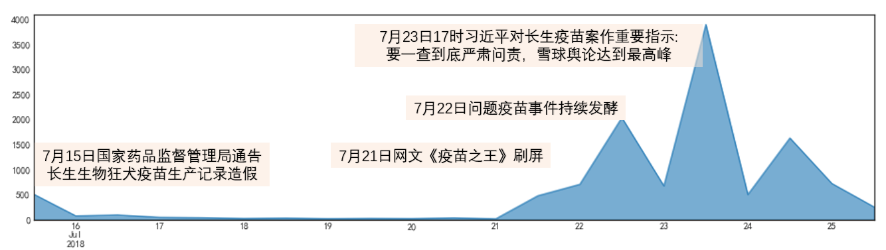
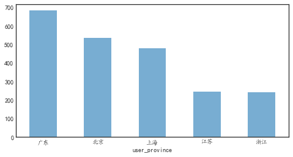
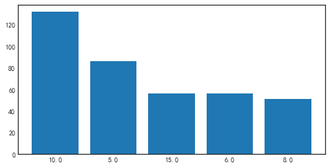

# 从一只爬虫的角度看长生问题疫苗事件

先奉上雪球股民关于长生问题疫苗事件的词云图。

## 事件回顾

2018年7月15日，国家药品监督管理局发布通告指出，长春长生生物科技有限公司冻干人用狂犬病疫苗生产存在记录造假等行为。 2018年7月22日，李克强总理就疫苗事件作出批示。7月23日，正在国外访问的习近平主席对吉林长春长生生物疫苗案件作出重要指示指出，长生生物公司违法违规生产疫苗行为，性质恶劣，令人触目惊心。 2018年7月24日，长生生物董事长高某芳等15名涉案人员因涉嫌刑事犯罪，被刑事拘留强制措施。 

## 雪球数据爬虫

作为一名老股民，我既为长生生物的故意造假的恶劣行为感到气愤，又对买了长生生物股票的股民感到悲伤。长生问题疫苗事件持续登上了雪球的今日话题，为了一探雪球上股民们对长生问题疫苗事件的看法，我用python爬虫，爬取了3740条讨论、8338条评论数据。

技术路线为：requests+BeautifulSoup的技术路线，通过谷歌浏览器的开发者工具，查询到评论数据的接口地址，通过修改user-agent、伪装cookies、放慢请求速度等，进行异步数据爬虫，爬取的数据存储到MYSQL数据库，最后通过pandas进行数据分析，详细技术实现请见我的技术贴《用requests库进行雪球评论异步数据爬取》。

## 舆情分析

#### 按时间发展看

上图中，横轴为时间，7月15日-7月25日，纵轴为评论数量，可以看到7月15日药监局通告长生生物造假，评论数超500，随后平复，在21日开始评论数大幅上升，22日李克强总理做出批示，雪球讨论数进一步上升，23日正在国外访问的习近平主席做出重要指示，雪球舆论达到顶峰。

#### 按地域看

参与讨论长生疫苗问题的用户，广东最多，北京、上海次之，看来经济发达的省份踩中长生生物这个雷的也更多，而且我大广东的股民们损失是最多的，呜呜。

### 股友的评论词云

那么损失严重的股民们对长生问题疫苗事件的看法如何呢，请看词语图：

虽然长生生物的股民们因为踩雷损失不少，但是从词云图中可以看出，对于此次疫苗事件，股民们都希望造假企业付出沉重代价，退市、跌停是股民们最大的希望，并对监管问题、和对涉案人员的处理表示关心，甚至出现死刑的字眼。 下面展示出点赞最多的5条评论，括号内为点赞次数：

> - (跌停)10个起步，15个不多，20个刚好，最后退市！支持草菅人命的无良企业退市的朋友请点赞！这次要... (1646)
> - 这事要在国外，长生死十次都不够！在天朝，要么自己去报仇，要么不了了之！ (1473)
> - 这个必须给深圳所点赞。  (1184)
> - 长生生物，康泰生物 必须退市！退市！退市！ (954)
> - 国家监管形同虚设 (787)

## 跌停数预测

大家都希望长生生物这种无良企业应该退市，同样的股民们也对长生生物的跌停数进行了预测。我分析了所有的评论，发现有关股友预测跌停数的评论有972条，爬取的数据是截止7月25日，长生生物已跌停7次，预测还会有10个跌停的股友最多，股友们预测跌停数的平均值为13个，其中还有股友预测还会跌停100次，哈哈，手动点个赞。

长生生物是否会跟股友们预测一样，跌停10次呢，我们继续关注。